# AWS Multi-AZ Task Management Platform

A production-style 3-tier AWS architecture built with Terraform, featuring Multi-AZ networking, load balancing, Auto Scaling, PostgreSQL RDS, IAM-based secret access, CloudWatch monitoring, remote Terraform state, and GitHub Actions CI/CD.

The application was deployed and tested end-to-end, including writing and retrieving task data from PostgreSQL through the application tier.

> The live infrastructure was destroyed after validation to avoid unnecessary AWS charges.

---

## Architecture

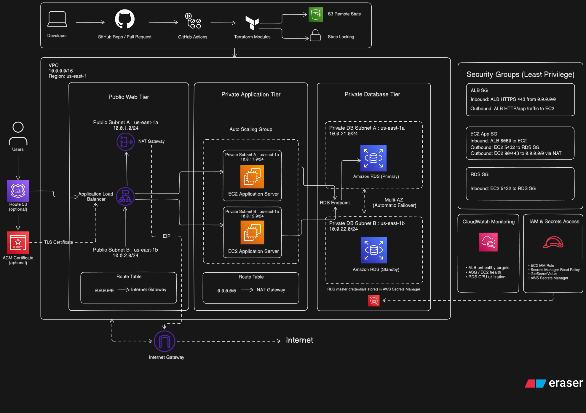

### Request Flow

```text
User
  ↓
Application Load Balancer
  ↓
EC2 Auto Scaling Group
  ↓
Python Task API
  ↓
Amazon RDS PostgreSQL
```

The deployed environment used the AWS-generated ALB DNS name over HTTP.

**Route 53 and ACM are shown as optional extensions** for a custom domain and HTTPS.

---

## Technologies

- **Infrastructure as Code:** Terraform
- **Cloud:** AWS
- **Networking:** VPC, public/private subnets, route tables, Internet Gateway, NAT Gateway
- **Compute:** EC2, Launch Templates, Auto Scaling
- **Load Balancing:** Application Load Balancer
- **Database:** Amazon RDS PostgreSQL
- **Security:** IAM, Security Groups, AWS Secrets Manager
- **Monitoring:** Amazon CloudWatch
- **Remote State:** Amazon S3 with state locking
- **CI/CD:** GitHub Actions
- **Authentication:** GitHub OIDC → AWS IAM
- **Application:** Python HTTP API

---

## Infrastructure Design

The VPC uses a `10.0.0.0/16` CIDR and spans two Availability Zones.

```text
Public Subnets
10.0.1.0/24  - us-east-1a
10.0.2.0/24  - us-east-1b

Private Application Subnets
10.0.11.0/24 - us-east-1a
10.0.12.0/24 - us-east-1b

Private Database Subnets
10.0.21.0/24 - us-east-1a
10.0.22.0/24 - us-east-1b
```

The Application Load Balancer is deployed across both public subnets.

Two EC2 application servers run inside the private application subnets through an Auto Scaling Group.

Amazon RDS PostgreSQL runs privately using a Multi-AZ configuration across the database tier.

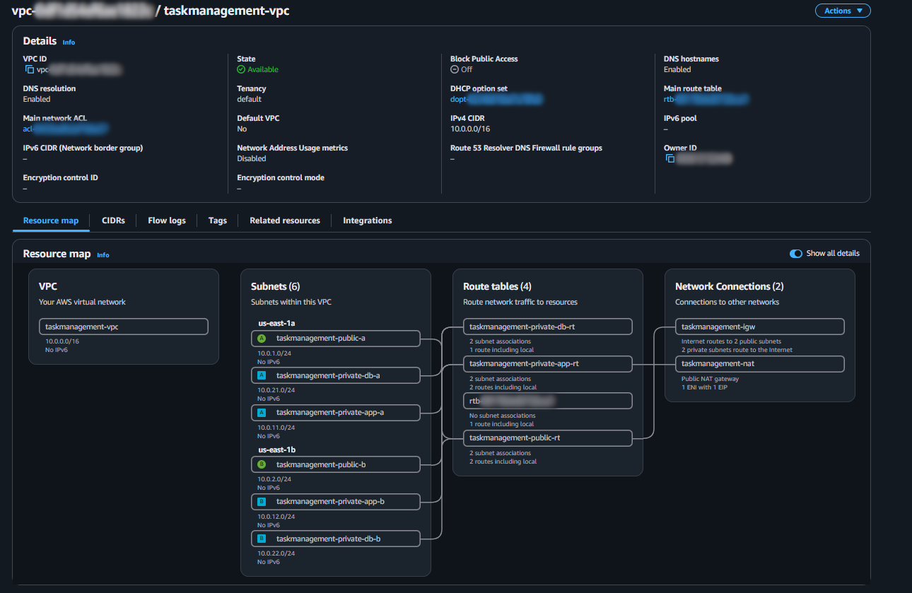

---

## Application

The EC2 instances run a lightweight Python task API on port `8080`.

The application retrieves the RDS credentials from AWS Secrets Manager and connects to PostgreSQL.

Supported endpoints include:

```text
GET /
GET /tasks
POST /tasks
```

Example application response:

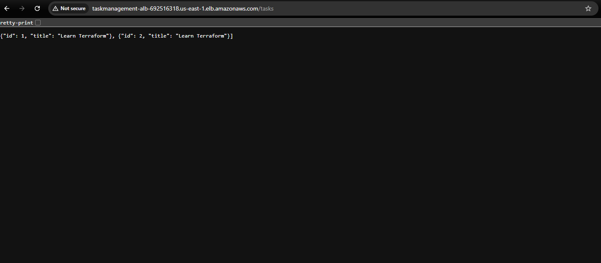

This validates the full request path:

```text
Browser
→ ALB
→ EC2 Python Application
→ PostgreSQL RDS
→ JSON Response
```

---

## Load Balancing and High Availability

The internet-facing Application Load Balancer accepts HTTP traffic on port `80` and forwards requests to the application target group on port `8080`.

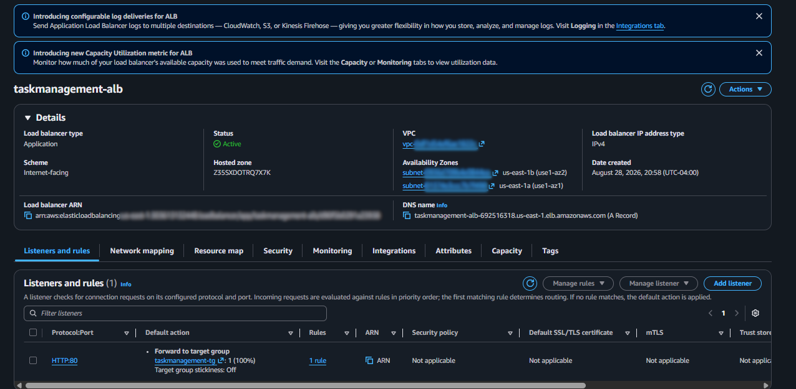

The target group contained two healthy EC2 instances distributed across separate Availability Zones.

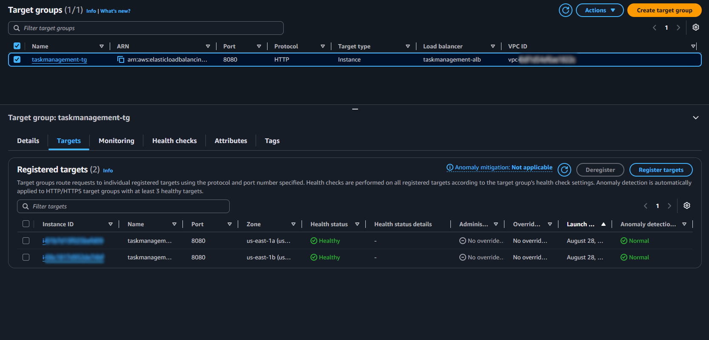

The Auto Scaling Group was configured with:

```text
Minimum capacity: 2
Desired capacity: 2
Maximum capacity: 2
```

This provides instance replacement and Multi-AZ availability.

---

## Database

Amazon RDS PostgreSQL provides the database tier.

Key configuration:

```text
Engine: PostgreSQL 16
Instance: db.t3.micro
Storage: 20 GiB gp3
Multi-AZ: Enabled
Public access: Disabled
Storage encryption: Enabled
Credentials: AWS Secrets Manager
```

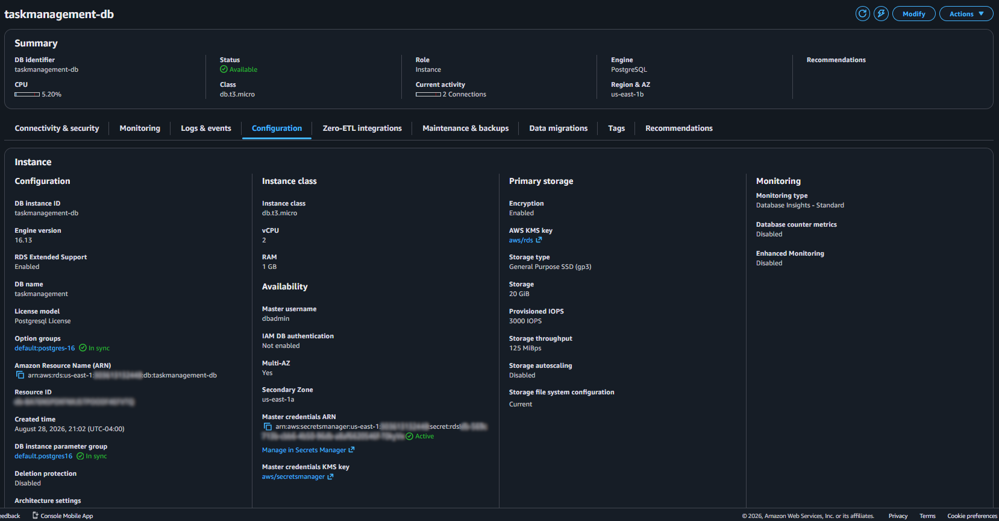

The application never stores the database password directly in Terraform code or EC2 user data.

Instead:

```text
EC2 Instance Profile
        ↓
IAM Role
        ↓
Secrets Manager Read Policy
        ↓
GetSecretValue
        ↓
RDS Credentials
```

---

## Security

The environment uses security-group-to-security-group rules to restrict traffic between tiers.

### ALB Security Group

Internet traffic is allowed to the load balancer on ports `80` and `443`.

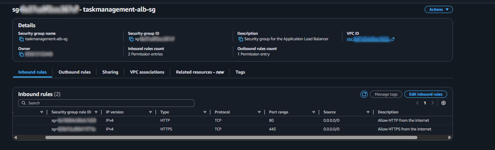

### EC2 Security Group

The application servers receive application traffic from the ALB and can communicate with RDS on PostgreSQL port `5432`.

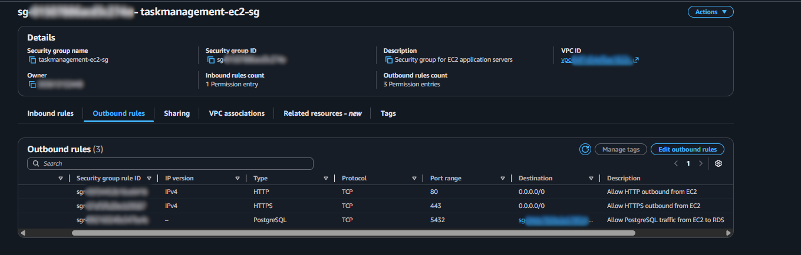

### RDS Security Group

The database accepts PostgreSQL traffic only from the EC2 application security group.

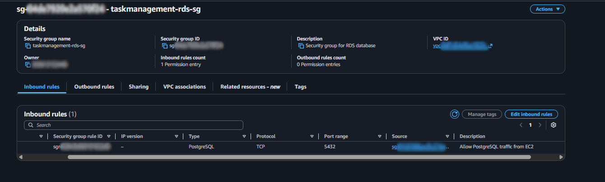

Conceptually:

```text
Internet
   ↓
ALB
   ↓
EC2 :8080
   ↓
RDS :5432
```

---

## Monitoring

CloudWatch alarms monitor important infrastructure health signals.

Configured alarms include:

```text
ALB unhealthy targets
ASG in-service instance count
RDS CPU utilization
```

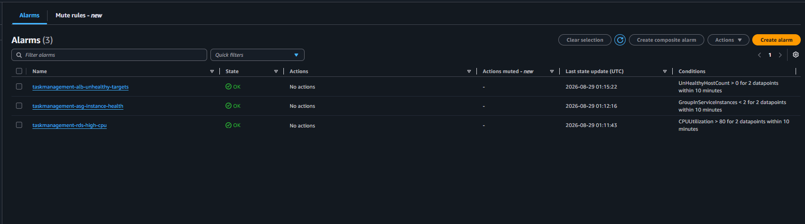

---

## Terraform Structure

The infrastructure is separated into reusable Terraform modules.

```text
.
├── environments/
│   └── dev/
│       ├── backend.tf
│       ├── main.tf
│       ├── outputs.tf
│       ├── provider.tf
│       └── variables.tf
│
├── modules/
│   ├── alb/
│   ├── compute/
│   ├── iam/
│   ├── monitoring/
│   ├── rds/
│   ├── security/
│   └── vpc/
│
├── .github/
│   └── workflows/
│       ├── terraform-ci.yml
│       └── terraform-cd.yml
│
└── docs/
```

The root environment coordinates the child modules while outputs and variables connect resources between modules.

---

## Remote Terraform State

Terraform state is stored remotely in Amazon S3.

```text
GitHub Actions / Terraform
          ↓
      S3 Backend
          ↓
dev/terraform.tfstate
```

State locking is enabled to prevent multiple Terraform operations from modifying the same state simultaneously.

The backend S3 bucket is treated as bootstrap infrastructure and is created separately from the main application stack.

---

## CI Pipeline

Terraform CI runs automatically when a pull request targets `main`.

The workflow performs:

```text
Checkout repository
        ↓
Setup Terraform
        ↓
terraform fmt -check -recursive
        ↓
terraform init -backend=false
        ↓
terraform validate
```

This prevents incorrectly formatted or invalid Terraform configuration from being merged without being detected.

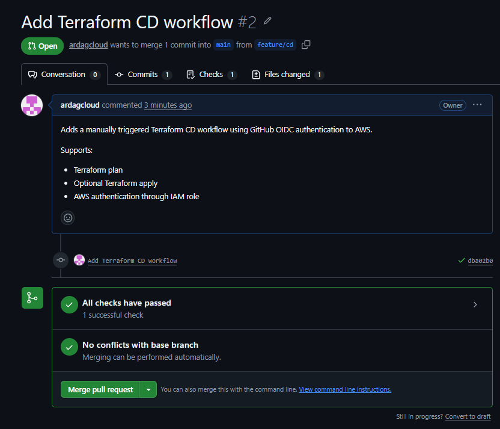

---

## CD Pipeline

The Terraform CD workflow authenticates GitHub Actions to AWS using **OpenID Connect (OIDC)**.

No long-lived AWS access keys are stored in GitHub.

```text
GitHub Actions
      ↓
GitHub OIDC Token
      ↓
AWS IAM Deployment Role
      ↓
Temporary AWS Credentials
      ↓
Terraform
```

The CD workflow is manually triggered and provides two options:

```text
plan
→ terraform init
→ terraform plan
→ no resources created

apply
→ terraform init
→ terraform plan
→ terraform apply
→ AWS infrastructure deployed
```

The final portfolio validation used **plan mode**, allowing the complete Terraform configuration to be evaluated without recreating billable AWS infrastructure.

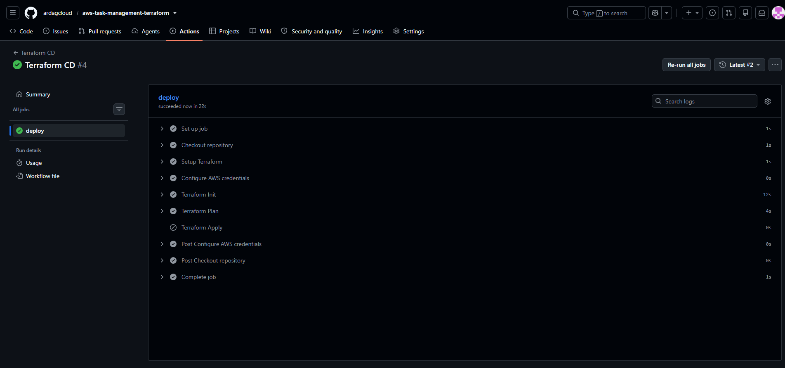

---

## Validation

The environment was deployed and tested before being destroyed.

Testing verified:

- ALB successfully routed traffic to both EC2 instances
- Both ALB targets were healthy across two Availability Zones
- The Python application successfully connected to PostgreSQL RDS
- Tasks could be inserted and retrieved from the database
- RDS credentials were retrieved through AWS Secrets Manager
- CloudWatch alarms were active
- Terraform remote state and locking functioned through S3
- GitHub Actions successfully authenticated to AWS through OIDC
- CI successfully validated pull requests
- CD successfully generated the complete Terraform deployment plan

The final CD plan identified **44 AWS resources to create** without applying the deployment.

---

## Cost Management

Some components in this architecture can generate ongoing AWS charges, particularly:

```text
NAT Gateway
Application Load Balancer
Multi-AZ RDS
EC2
```

After deployment testing and screenshots were completed, the Terraform-managed infrastructure was destroyed.

The S3 backend remains available for remote Terraform state.

---

## Key Takeaways

This project demonstrates practical experience with:

- Terraform module design
- Multi-AZ AWS networking
- Private application and database tiers
- Load balancing and Auto Scaling
- PostgreSQL RDS
- IAM roles and instance profiles
- AWS Secrets Manager
- Least-privilege security-group design
- CloudWatch monitoring
- Remote Terraform state and locking
- Git feature-branch and pull-request workflows
- GitHub Actions CI/CD
- AWS authentication using GitHub OIDC
- End-to-end application and database integration

---

## Future Improvements

Potential production improvements include:

```text
Route 53 custom domain
ACM TLS certificate
HTTPS-only ALB listener
Multi-NAT-Gateway architecture
SNS alarm notifications
Dynamic Auto Scaling policies
Containerized application deployment
Additional application endpoints and authentication
```

Route 53 and ACM are represented in the architecture diagram as optional extensions and were not part of the tested deployment.